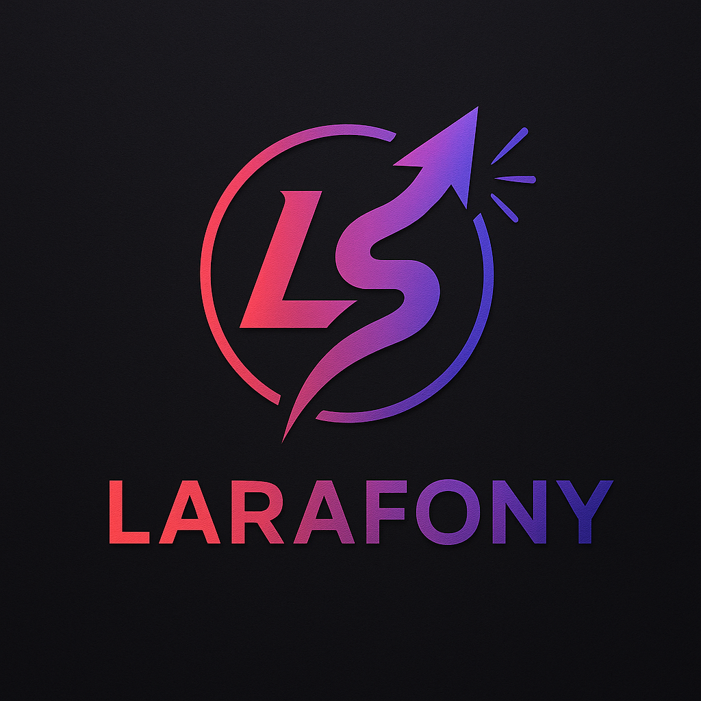

# Larafony

**Larafony** is a modern, lightweight PHP framework that combines the **developer experience of Laravel**, the **robustness of Symfony**, and the **power of PHP 8.5** — all without compromise.  
It’s designed for **production-grade applications**, not tutorials or demos.

---

## ✨ Key Features

- **⚙️ Built on PSR Standards**  
  Full support for **PSR-7 (HTTP)**, **PSR-11 (Container)**, **PSR-15 (Middleware)**, and **PSR-3 (Logger)**.  
  Interoperability at its core — use any compliant library or component you prefer.

- **🧩 Attribute-Based Design**  
  Fully powered by **PHP Attributes**, bringing clean syntax and native reflection instead of verbose annotations or configuration files.

- **🔓 Not Locked into One Ecosystem**  
  You’re free to choose your tools. Larafony works seamlessly with:
    - **Inertia.js**
    - **Vue.js**
    - **Blade**
    - **Twig**

- **🪶 Minimal Dependencies**  
  A **minimal `composer.json`** — PSR packages only. No unnecessary framework bloat.

- **🧱 Custom Middleware Stack**  
  A powerful yet simple **middleware pipeline**, inspired by PSR-15 and fine-tuned for performance.

- **📊 Built-in Backend Analytics**  
  Privacy-friendly, **cookie-free analytics**, with no dependence on Google or external trackers.

---

## 🚀 Philosophy

> **Larafony** exists for developers who love the elegance of Laravel, the discipline of Symfony, and the freedom of pure PHP.  
> It’s opinionated where it matters — and unopinionated everywhere else.

- **Production-ready from day one**
- **Framework-agnostic mindset**
- **Performance-first architecture**
- **Readable, modern PHP code**

---

## 🧰 Requirements

- PHP ≥ 8.5
- Composer
- PSR-compliant HTTP and container packages (installed automatically)

## 🧭 Roadmap

> Each chapter is developed in a separate branch and includes unit tests using PHPUnit.

### 🧩 Core Foundation
- [x] Base framework configuration — [Chapter 1](docs/Larafony/chapter1.md)
- [x] Simple error handling — [Chapter 2](docs/Larafony/chapter_2.md)
- [x] Simple timer using PSR-20 (Simple Carbon replacement) — [Chapter 3](docs/Larafony/chapter_3.md)
- [ ] HTTP requests with PSR-7/PSR-17 (Simple Web Kernel) — Chapter 4
- [ ] Dependency Injection using PSR-11 — Chapter 5

### 🌐 HTTP Layer
- [x] Routing using PSR-15 — [Chapter 6](docs/Larafony/chapter6.md)
- [x] HTTP client using PSR-18 (Simple Guzzle replacement) — [Chapter 7](docs/Larafony/chapter7.md)
- [x] Environment variables and configuration — [Chapter 8](docs/Larafony/chapter_8.md)

### ⚙️ Console & Database
- [x] Console Kernel — [Chapter 9](docs/Larafony/chapter9.md)
- [ ] DBAL Core & Contracts — Chapter 10
- [ ] MySQL Schema Builder — Chapter 11
- [ ] MySQL Query Builder — Chapter 12
- [ ] MySQL Migrations — Chapter 13
- [ ] ORM — Chapter 14

### 🧱 Application Layer
- [ ] Logging System (PSR-3) — Chapter 15
- [ ] Middleware System (PSR-15) — Chapter 16
- [ ] Advanced Routing — Chapter 17
- [ ] DTO-based Form Validation — Chapter 18

### 🎨 View Layer
- [ ] View Core & Contracts — Chapter 19
- [ ] Custom Blade Parser — Chapter 20
- [ ] Twig Wrapper — Chapter 21
- [ ] Inertia.js Middleware (Vue.js SPA) — Chapter 22

### 💥 Error Handling
- [ ] Advanced Web Error Handling — Chapter 23
- [ ] Advanced Console Error Handling — Chapter 24

### 🔐 Security & Communication
- [ ] Encrypted Cookies and Sessions — Chapter 25
- [ ] Sending Emails (Symfony Mailer) — Chapter 26
- [ ] Authorization System — Chapter 27
- [ ] Cache Optimization (PSR-6) — Chapter 28
- [ ] Event System (PSR-14 and alternatives) — Chapter 29
- [ ] Jobs and Queues — Chapter 30
- [ ] Simple WebSockets (almost from scratch) — Chapter 31
- [ ] PSR — A new way of communication — Chapter 32

### 🧭 Meta
- [ ] Why Larafony — Comparing with Laravel, Symfony, CodeIgniter — Chapter 33

## 🚀 Learn How It’s Built—From Scratch

Interested in **how Larafony is built step by step?**

Check out my full PHP 8.5 course, where I explain everything from architecture to implementation — no magic, just clean code.

👉 Get it now at [masterphp.eu](https://masterphp.eu)

## Additional Resources

- [PSR Standards](https://www.php-fig.org/psr/)
- [PHPUnit Documentation](https://phpunit.de/)
- [PHPStan Documentation](https://phpstan.org/)
- [Composer Documentation](https://getcomposer.org/doc/)